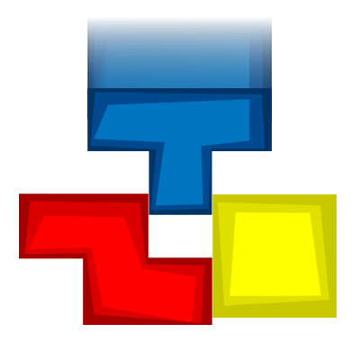

# Quadra Blocks

Play online: https://yqnn.github.io/quadra-blocks/

## Introduction

This is a game I wrote in 2009 as a test project to learn Javascript.
It doesn't use any fancy library or modern Javascript feature, and is not guaranteed to be bug free.

To make it more playable, I've just added a configuration menu, and a table that saves best scores.

## Modes

- *Normal* : classical mode, with random blocks.
- *Nasty* : the game will sometimes give you the worst blocks instead of a random one.
- *Cruel* : the game will always give you the worst blocks. Only for the brave ones.

## Copyright

Some of the assets used by this game has been shamelessly reused from someone else work.

**Credits**

| Asset |  Author | Licence |
|--|--|--|
|  *Style:2* visuals | Steve Chamberlin  | |
| *Music:1* background music | Skandalo Publico  | Creative Commons by 2.0 license |
| *Music:2* background music | Peter Wagner |  |
| *Music:2* sound effects | Steve Chamberlin  |  |
